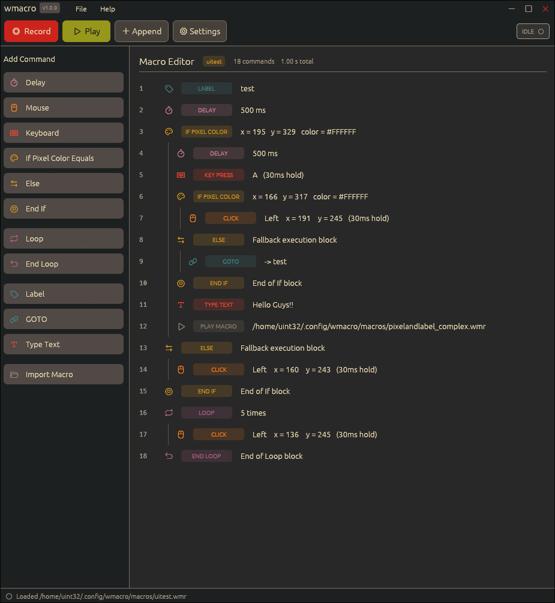
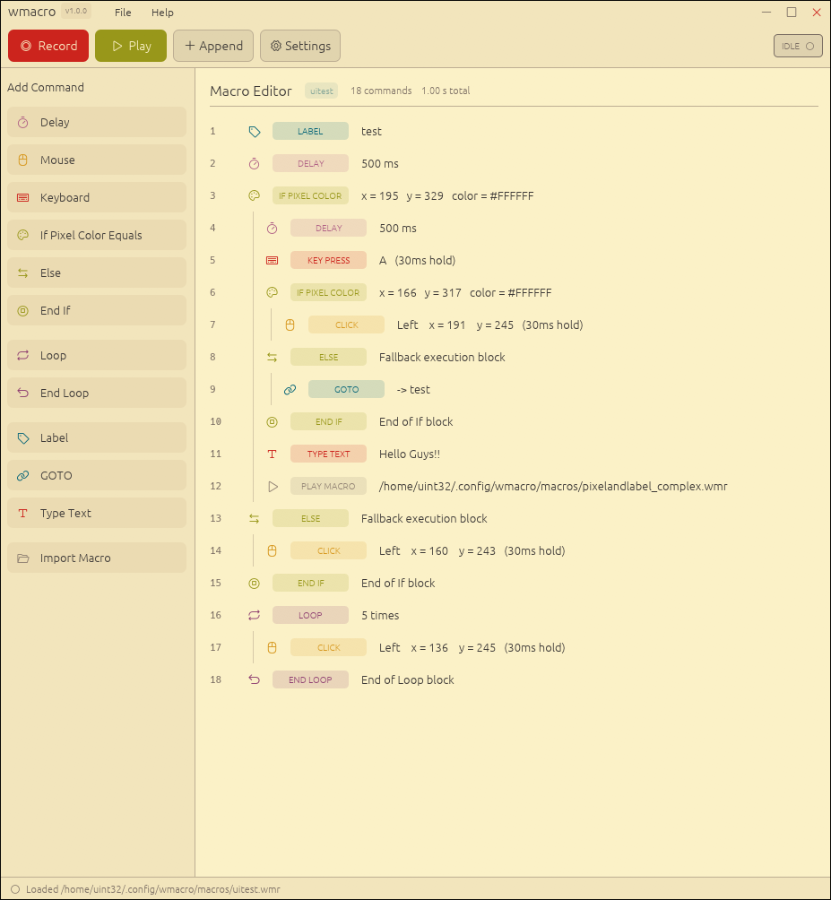

# Wmacro
[](https://aur.archlinux.org/packages/wmacro)
[](https://github.com/uint82/wmacro/releases)

<p align="center">
    
</p>


Wmacro is a macro recorder and automation tool for Hyprland on Wayland. Users can record, edit, and replay mouse/keyboard events.
It features a GUI with 13 built-in themes, customizable shortcuts, and support for custom `.wmr` files to save and edit macros.

---

## Table of Contents
* [Installation](#installation)
  * [Arch Linux (AUR)](#arch-linux-aur)
  * [Building from Source](#building-from-source)
* [Screenshots](#screenshots)
* [Features](#features)
  * [Record and playback](#record-and-playback)
  * [Editor and Flow Control](#editor-and-flow-control)
  * [Appearance](#appearance)
* [Roadmap](#roadmap)
* [Contributing](#contributing)
* [License](#license)

---

## Installation

### Arch Linux (AUR)

#### Stable release:
   ```bash
   paru -S wmacro
   ```
   or
   ```bash
   yay -S wmacro
   ```

#### Development version:
   ```bash
   paru -S wmacro-git
   ```
   or
   ```bash
   yay -S wmacro-git
   ```
After installation, add your user to the `wmacro` group:
   ```bash
   sudo usermod -aG wmacro $USER
   ```
Log out and log back in (or reboot) to reload your user group membership.
Then enable and start the daemon:
   ```bash
   sudo systemctl enable --now wmacro-daemon
   ```

### Building from Source

If you prefer to build manually or are on a different distribution, you can compile `wmacro` from source using `cargo`.

Build dependencies:

- Rust toolchain (`rust`, `cargo`)
- C compiler toolchain (`base-devel`)
- Wayland libraries (`wayland`)
- libxkbcommon (`libxkbcommon`)

Runtime requirements:

- Wayland compositor (e.g. Hyprland)
- `grim` (required for pixel color conditions)

1. Clone the repository and build the project:
   ```bash
   git clone https://github.com/uint82/wmacro.git
   cd wmacro
   cargo build --release --workspace
   ```

2. Run the daemon (requires root privileges to access input devices):
   ```bash
   sudo ./target/release/wmacro-daemon
   ```

3. In a separate terminal, run the GUI:
   ```bash
   ./target/release/wmacro-gui
   ```
---

## Screenshots

| Gruvbox Dark | Gruvbox Light  |
| :---: | :---: |
|  |  |

---

## Features

### Record and playback

- Mouse: movement, clicks, and scrolling
- Touchpad: movement, clicks, and drag and drop
- Keyboard: All keys
- Record/pause/resume
- Play/pause/resume
- Adjustable playback speed from `0.1x` to `10.0x`
- Adjustable repeat count and humanized playback using a hybrid synthetic path engine
- Smart Mouse Randomization with adjustable path wobble and endpoint jitter
- Humanized submovements and curve adjustments for mouse paths
- Customizable global hotkeys (default):
    - `F7` record/pause
    - `F8` abort recording
    - `F9` play/pause
    - `F10` abort playback
    - `Shift + k` step-by-step
    - `F2` Capture Coordinate

### Editor and Flow Control
- Full GUI editor for creating and modifying macros
- Drag and drop command reordering
- Type text action for fast text input
- Logic and Flow Control:
    - If Pixel Color condition
    - Loop and EndLoop
    - Else and EndIf
    - Goto and Label
- Execute other macros from within a macro
- Custom `.wmr` files for saving and loading macros

### Appearance
- 13 built-in themes
- Modern interface with customizable settings
- User can add their own themes in `.config/wmacro/themes/`

#### Creating Custom Themes

To create a custom theme, place a `.json` file in `~/.config/wmacro/themes/` using the structure below. Colors must be provided in 6-character hex format (e.g., `#FFFFFF`).

```json
{
  "name": "My Custom Theme",
  "is_dark": true,
  "bg_base": "#1e1e2e",
  "bg_surface": "#181825",
  "bg_element": "#313244",
  "bg_element_alt": "#45475a",
  "border": "#cba6f7",
  "text_primary": "#cdd6f4",
  "text_muted": "#a6adc8",
  "accent_primary": "#cba6f7",
  "accent_primary_fg": "#11111b",
  "accent_danger": "#f38ba8",
  "accent_danger_fg": "#11111b",
  "accent_success": "#a6e3a1",
  "accent_success_fg": "#11111b",
  "col_delay": "#f9e2af",
  "col_move": "#89b4fa",
  "col_click": "#f38ba8",
  "col_keyboard": "#cba6f7",
  "col_if": "#94e2d5",
  "col_else": "#94e2d5",
  "col_end_if": "#94e2d5",
  "col_loop": "#f5c2e7",
  "col_end_loop": "#f5c2e7",
  "col_label": "#b4befe",
  "col_goto": "#b4befe",
  "col_type_text": "#a6e3a1",
  "col_import_saved_macro": "#f38ba8"
}
```
---
## Roadmap
- [ ] Expand flow control with advanced variables and conditions
- [ ] Additional IDE themes and layout customizations
- [ ] Add more wayland compositor support

## Contributing
Contributions are always welcome! If you have a feature request, bug report, or want to submit a pull request, please check the [issues page](https://github.com/uint82/wmacro/issues) on GitHub.

When submitting PRs, please ensure your code builds cleanly and follows the existing Rust conventions.

## License
This project is licensed under the GPL-3.0-only License - see the [LICENSE](LICENSE) file for details.
